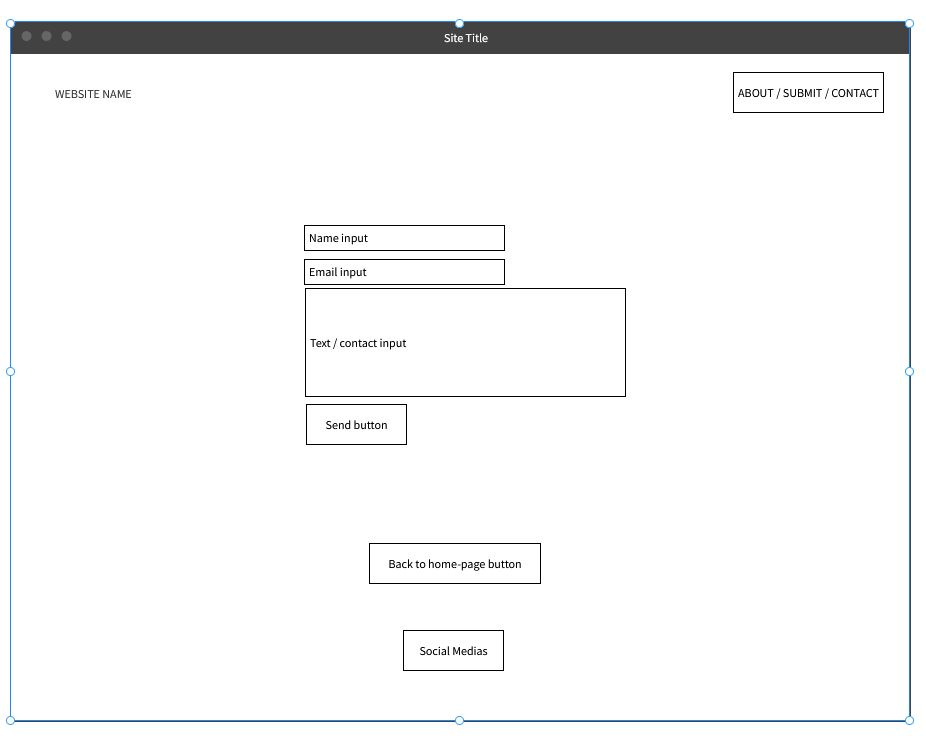
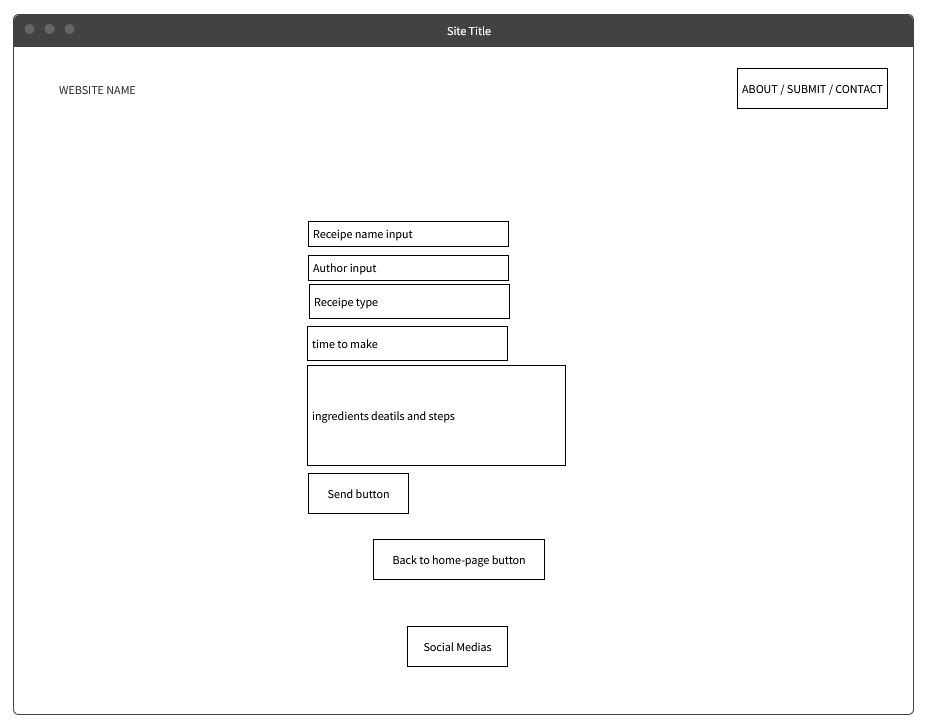
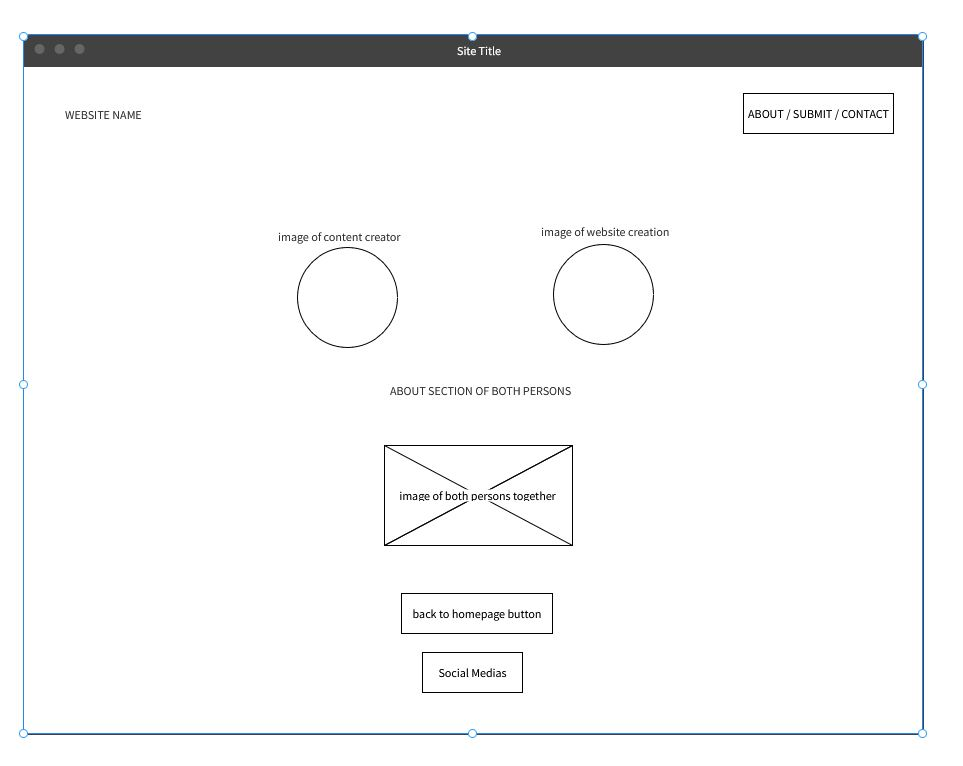

<h1><strong>Home Recepies</strong></h1>

Welcome to our receipe site.

This website is a static frontended responsive website for homemade receipes from my partner.
Receipes will include a Spanish Omeltte, an alcoholic whiskey cocktail and how to make a perfect latte with an affordable coffee machine. 

<h2> Table of contents</h2>

<ol>
<li><a href='#team'>Team</a></li>

<li><a href='#ux'>UX</a></li>

<li><a href='#feature'>Features and list of pages</a></li>

<li><a href='#style'>Testing</a></li>

<li><a href='#tools'>Tools used</a></li>

<li><a href='#deploayment'>Deploayment</a></li>

<li><a href='#acknowledgements'>Credits and Achknowledgments</a></li>
</ol>

<h2>Team
<a href='#team'>
</h2> </a>
<li> <strong>Creator / Author</strong> - Richard Glennon </li>
<li> <strong>Content creator</strong> - Estrella </li>
<li> <strong>Mentor</strong> - Narender Singh </li>
  

<h2>UX 
<a href='#ux'>
</h2> </a>
<strong>Wireframe</strong>

Wireframes developed with <a href='https://www.mockflow.com'>Mockflow.com</a>
<h3>Main page</h3>
 
<h3>Receipe page</h3>
 
<h3>Contact page</h3>
 
<h3>Contact page</h3>
 
<h3>About page</h3>
 

  

<h2>New features and features to develope 
<a href='#feature'>
</h2> </a>
<ol>
<li>Main page as introduction to the website creator and content creator</li>
<li>Carrossel of images for guide of the receipes</li>
<li>Contact page to change or edit receipe if needed</li>
<li>Submit a receipe page for users to submit their own homemade food or drinks</li>
</ol>
<h2> Pages</h2>
<ol>
<li>Home page</li>
<li>About page</li>
<li>Receipe page</li>
<li>Contact page</li>
<li>Submit a Receipe page</li>
</ol>
<h2> User cases </h2>
This website will be designed for anyone with the ability to cook and prepare foods. There will be an alcohol section on how to make cocktails however this will be noted on the page that only users of the age of 18 should be creating these receipies.  
Users will use the site to search, select and view images along with short text description on how to perform the steps.  
Any user can submit a receipe for review and have it posted on the site under their name. During the submitting process, the user can navigate back to the home page and search more receipes to keep the user engagned. 
Users can easily contact the websites content creator or website creator by simply submitting a contact form.
  

<h2> Testing
<a href='#style'>
</h2> </a>
<li></ul>HTML</li>
Testing will be carried out on all pages of the website using the HTML validator <a href='https://validator.w3.org/'>W3C validator</a>

<li></ul>CSS</li>
Testing will be carried out also, using the <a href='https://jigsaw.w3.org/css-validator/'> Jigsaw CSS validator</a>
  

<h2> Deployment
<a href='#deployment'>
</h2> </a>
The front end website will be deployed and hosted via the GitHub platform. 
<ol>
<li>Github repository of files:</li>
<ul> LINK GOES HERE</ul>
<li>Master Branch:</li>
<ul> LINK GOES HERE</ul>
<li>Live site:</li>
<ul> LINK GOES HERE</ul>
</ol> 

<h2> Credits and Achknowledgments
<a href='#achknowledgment'>
</h2> </a>

Fill out at the end of the project
